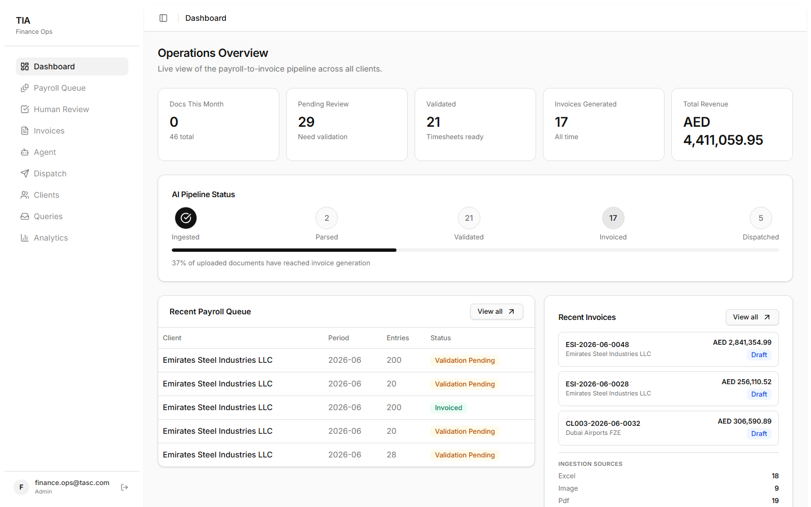

# TIA — Touchless Invoice Agent

> **Finance Operations Automation Platform** that converts raw timesheets into validated, calculated, client-ready invoices — with zero manual data entry.

---



---

## What is TIA?

TIA is a production-grade invoice automation platform built for staffing, workforce-management, and payroll-outsourcing businesses. It replaces the manual, error-prone cycle of receiving timesheets, calculating payroll, validating records, and issuing invoices with a fully automated pipeline — from Gmail inbox to signed-off PDF invoice.

Finance teams stop spending days on data entry and start spending minutes on exceptions. Clients stop chasing invoices over email and get a self-service portal. Finance managers get a voice-enabled AI agent that answers billing questions in real time.

---

## Business Value at a Glance

| Pain Point | TIA Solution |
|---|---|
| Timesheets arriving in PDF, Excel, images, and email body | Universal multi-format AI parser |
| Manual keying errors and duplicate employee rows | 5-rule automated validation engine with a review queue |
| Hours spent recalculating pro-rated salaries and overtime | Formula engine against centralized payroll master contracts |
| Invoice generation cycle taking 2–3 business days | One-click or fully automated PDF invoice generation |
| Clients emailing for invoice status updates | Self-service client portal with live invoice tracking |
| Finance managers querying ops teams for numbers | Natural-language voice agent with instant answers |
| Missed or double-processed timesheet emails | Gmail OAuth2 auto-sync with built-in deduplication |
| No audit trail for compliance and dispute resolution | Immutable audit log on every state change |
| Sensitive payroll data reachable by anyone with the URL | Firebase Authentication with server-enforced roles and per-client data isolation |

---

## Feature Deep Dive

### 1. Touchless Gmail Ingestion

TIA connects to a configured Gmail account via OAuth2 and runs an automatic background poller every 30 seconds. When a timesheet arrives — whether as a PDF attachment, Excel file, CSV, image, or inline in the email body — TIA automatically saves, classifies, parses, and persists it to the database. No human action is needed. Processed Gmail message IDs are tracked in `storage/gmail_processed.json` to guarantee zero duplicate ingestion, even across restarts.

**Business impact:** Eliminates the manual step of downloading attachments, renaming files, and uploading them one by one. Staff simply send an email; TIA handles everything else.

---

### 2. Universal Multi-Format Document Parser

Timesheets never arrive in a consistent format. TIA handles every variant:

- **PDF** — Layout-aware extraction using Docling; OCR fallback via Tesseract for scanned or print-to-PDF documents
- **Excel & CSV** — Dynamic header detection across the first 15 rows; captures working days, overtime hours, leave days, and per-employee salary overrides
- **Images & Handwritten Sheets** — OpenCV preprocessing + Tesseract OCR pipeline, followed by AI correction
- **Email Body** — Direct extraction from inline timesheet tables embedded in the email text

**Business impact:** No more rejecting non-standard formats or asking clients to resubmit. TIA processes whatever they send.

---

### 3. AI-Powered OCR Correction (Groq + Llama 4 Scout)

For scanned documents and handwritten timesheets where raw OCR produces noise — misread characters, broken columns, misaligned rows — TIA sends the extracted table to **Groq's Llama 4 Scout 17B Instruct** model. The LLM interprets ambiguous output, reconstructs column alignment, and returns a clean, structured payload that feeds directly into the validation engine.

**Business impact:** Scanned and handwritten timesheets are no longer dead ends that require manual re-keying. The AI corrects them automatically with high accuracy.

---

### 4. Business Validation Engine — 5 Core Rules

Before a single invoice line is calculated, TIA runs every extracted timesheet row through five configurable validation rules:

| Rule | What It Catches |
|---|---|
| **Employee Exists** | Employee code not found in the employee master |
| **Client Match** | Employee is assigned to a different client |
| **Working Days Limit** | Working days exceed the client's configured monthly threshold |
| **Duplicate Employee** | Same employee code appears more than once in the sheet |
| **Overtime Limits** | OT hours exceed the allowed ceiling per contract |

Violations are surfaced in the **Validation Queue** with severity levels — Error, Warning, or Info. Finance ops can review each flag, apply an override with a reason, or escalate before invoice generation is unlocked. All override decisions are logged to the audit trail.

**Business impact:** Catches billing errors before they reach the client. Prevents overpayment, undercharging, and compliance exposure without requiring manual row-by-row inspection.

---

### 5. Payroll Calculation Engine

TIA resolves each employee's billing against a **PayrollMaster** — structured payroll contracts that store:

- Basic salary
- Housing, transport, food, and phone allowances
- Standard deductions
- Client service fee percentage
- Applicable taxes

When a timesheet row carries a salary override (e.g., a mid-month rate change), it takes priority over the contract. The engine then computes:

- Pro-rated gross salary based on actual working days vs. the billing month
- Overtime earnings at the contracted OT rate
- Total allowances and deductions
- Client service fee and tax
- Net billable amount per employee

**Business impact:** Eliminates manual spreadsheet calculations for every billing cycle. Consistent, auditable, formula-driven results replace error-prone human math.

---

### 6. Invoice Generation & Full Lifecycle Management

Validated timesheets produce professional PDF invoices rendered from Jinja2 templates. Each invoice includes:

- Unique invoice number and billing period
- Line-item breakdown per employee (gross salary, OT, deductions, bill amount)
- Subtotals, service fees, taxes, and grand total
- Client and company details

Invoices flow through a tracked lifecycle managed entirely from the Finance Dashboard:

```
Draft → Sent → Paid
              ↘ Overdue
              ↘ Void
```

Finance teams can generate, preview, approve, and batch-dispatch invoices. Overdue detection runs automatically against due dates.

**Business impact:** Cuts invoice-to-dispatch time from days to minutes. Lifecycle tracking gives finance managers real-time visibility into outstanding receivables without querying anyone.

---

### 7. Finance Command Agent with Voice Feedback

A natural-language AI agent lets finance managers ask questions and issue commands directly from the dashboard:

- *"How many invoices are pending this month?"*
- *"What is the total outstanding amount for Client XYZ?"*
- *"Which timesheets failed validation this week?"*
- *"Generate invoice for client CL001 for June 2026."*

Beyond the built-in commands, the agent answers **free-form analytical questions grounded in live database data** (RAG): it plans a read-only SQL query from the schema, executes it with strict SELECT-only guards, and answers strictly from the returned rows — e.g. *"which employee had the most overtime in June?"* or *"top 3 most common validation failures?"*. Powered by **Groq — Llama 4 Scout**.

Every response is delivered as text **and** as synthesized voice audio powered by **[Smallest.ai](https://smallest.ai) Lightning TTS v3.1** — one of the fastest and most natural-sounding text-to-speech APIs available. Six voice options are configurable: Jessica (default), Rachel, David, Alex, Noah, and John. Audio is generated at 24,000 Hz in MP3 format with a 45-second generation timeout.

**Business impact:** Finance managers get instant answers without opening reports, querying databases, or waiting on analysts. The voice interface makes the agent usable during calls or while multitasking.

---

### 8. Real-Time Finance Dashboard

The admin dashboard gives the entire finance team a unified command center:

- **Overview** — Pipeline KPIs: total documents processed, invoices issued, validation issue rate, revenue totals
- **Documents** — Upload history, per-document processing status, extraction confidence scores, source type breakdown
- **Timesheets** — Parsed employee records filterable by client, billing month, and year with per-row drill-down
- **Validation Queue** — All rule violations with bulk resolution, override, and escalation tools
- **Invoices** — Full lifecycle management: generate, preview, status updates, batch dispatch
- **Clients** — Client master data and per-client rule configuration (thresholds, OT caps, billing rules)
- **Finance Agent** — Voice-enabled natural-language command interface

---

### 9. Client Self-Service Portal

Each client gets an isolated, branded portal:

- **Upload timesheets** directly without emailing an ops contact
- **View invoice history** — paid, pending, and overdue
- **Track outstanding amounts** in real time
- **Submit support queries** with status tracking and resolution updates

**Business impact:** Reduces inbound email volume to the finance team. Clients have 24/7 visibility into their billing without depending on anyone to respond.

---

### 10. Immutable Audit Trail

Every action in TIA — document upload, OCR extraction, validation override, invoice approval, status change, client query resolution — is logged to an append-only audit trail with timestamps and user attribution. Finance teams have a complete, structured record for compliance audits, client disputes, and internal reviews.

---

### 11. Enterprise-Grade Security

Finance data demands defense in depth. TIA layers:

- **Firebase Authentication** — email/password and Google sign-in; passwords never touch TIA's servers or database (Google stores them hashed with hardened scrypt)
- **Server-enforced roles** — Firebase custom claims (`role`, `client_id`) verified on every `/api/v1` request; the back office is admin-only and client portal users are locked to their own client's data, regardless of what the browser asks for
- **Login lockout** — 3 failed passwords trigger an escalating cooldown (30 s → 5 min), on top of Firebase's server-side brute-force protection
- **API hardening** — per-IP rate limiting (429 + `Retry-After`), request body size caps, upload type/size allowlist, and security headers (`nosniff`, `X-Frame-Options: DENY`, `Cache-Control: no-store`, CSP) on every response
- **Protected file storage** — uploaded payroll files and generated audio under `/storage` require an admin token
- **No secrets in git** — `.env` files and the Firebase service account key are gitignored; tracked `.env.example` templates document every variable

---

## Tech Stack

### Backend

| Component | Technology |
|---|---|
| API Framework | FastAPI 0.111+ |
| Database | SQLite via SQLAlchemy 2.0 async (aiosqlite) |
| Migrations | Alembic |
| PDF Extraction | Docling 2.0, pdf2image, pypdf |
| OCR Engine | Tesseract, OpenCV |
| Excel & CSV | Pandas 2.2, openpyxl 3.1 |
| LLM Correction | Groq API — Llama 4 Scout 17B Instruct |
| Invoice Rendering | Jinja2, xhtml2pdf |
| Voice Synthesis | Smallest.ai Lightning TTS v3.1 |
| Email Integration | Gmail OAuth2 |
| Authentication | Firebase Admin SDK — ID-token verification, custom-claim roles |
| Config & Validation | Pydantic v2, pydantic-settings |

### Frontend

| Component | Technology |
|---|---|
| Framework | React 19 |
| Authentication | Firebase JS SDK — email/password + Google sign-in |
| Routing | TanStack Router 1.170 |
| Data Fetching | TanStack Query 5 |
| Styling | TailwindCSS 4, Radix UI |
| Animations | Framer Motion 12 |
| Charts | Recharts 3 |
| File Upload | react-dropzone |
| HTTP Client | Axios 1.18 |
| Build | Vite 8, TypeScript 6 |

---

## Architecture Overview

```
Gmail Inbox / Direct Upload
            │
            ▼
    ┌───────────────────┐
    │  Ingestion Layer  │  ← dedup · classify · store
    └───────────────────┘
            │
            ▼
    ┌───────────────────┐
    │  Document Parser  │  ← PDF · Excel · Image · Email Body
    └───────────────────┘
            │
            ▼
    ┌─────────────────────────┐
    │  AI OCR Correction      │  ← Groq Llama 4 Scout 17B
    │  (scanned / handwritten)│
    └─────────────────────────┘
            │
            ▼
    ┌───────────────────────────┐
    │  Validation Engine        │  ← 5 configurable business rules
    └───────────────────────────┘
            │
            ▼
    ┌───────────────────────────┐
    │  Payroll Calculation      │  ← PayrollMaster contracts
    └───────────────────────────┘
            │
            ▼
    ┌───────────────────────────┐
    │  Invoice Generator        │  ← Jinja2 → PDF
    └───────────────────────────┘
            │
     ┌──────┴──────┐
     ▼             ▼
Finance         Client
Dashboard       Portal
     │
     ▼
Finance Agent
(NL queries + Smallest.ai Voice)
```

---

## Integrations

| Service | Purpose |
|---|---|
| **Groq API** — Llama 4 Scout 17B | AI correction of OCR-extracted tables from scanned and handwritten documents |
| **Gmail OAuth2** | Automated background ingestion of timesheet emails — attachments and inline body |
| **Smallest.ai Lightning TTS v3.1** | Real-time voice synthesis for Finance Agent responses |
| **Firebase Authentication** | User sign-in (email/password + Google) and ID-token verification with role/client custom claims |

---

## Getting Started — Running from Zero

### 1. Prerequisites

| Requirement | Notes |
|---|---|
| **Python 3.12+** | Backend runtime |
| **Node.js 20+** (with npm) | Frontend build/dev server |
| **[`uv`](https://docs.astral.sh/uv/)** *(recommended)* | Python dependency manager used by this repo (`pyproject.toml` + `uv.lock`). A plain `venv` + `pip` also works — see below. |
| **Tesseract OCR** on `PATH` | Only needed for scanned/handwritten timesheet images ([install guide](https://tesseract-ocr.github.io/tessdoc/Installation.html)) |
| **Groq API key** | [console.groq.com](https://console.groq.com) — powers OCR correction and the voice agent's data Q&A |
| **Smallest.ai API key** | [smallest.ai](https://smallest.ai) — voice replies for the Finance Agent (optional; text still works without it) |
| **Google Cloud project** | For Gmail inbox ingestion (optional; uploads still work without it) |
| **Firebase project** | [console.firebase.google.com](https://console.firebase.google.com) — user authentication (set `AUTH_ENABLED=false` to run without it locally) |

### 2. Clone

```bash
git clone <repo-url>
cd TIA
```

### 3. Backend — install dependencies

```bash
cd backend
uv sync                       # creates .venv from uv.lock
```

<details>
<summary>Without <code>uv</code> (plain venv + pip)</summary>

```bash
cd backend
python -m venv .venv
# Windows:  .venv\Scripts\activate     macOS/Linux:  source .venv/bin/activate
pip install -e .
```
</details>

### 4. Backend — configure environment

```bash
cp .env.example .env          # then edit .env
```

Every variable is documented inline in [`backend/.env.example`](backend/.env.example). Minimum to get running: nothing — the app boots with an empty `.env` (SQLite defaults, integrations disabled). For the full experience fill in:

- `GROQ_API_KEY` — enables AI OCR correction + agent free-form data questions
- `SMALLEST_API_KEY` — enables voice replies
- `GMAIL_*` — enables touchless mail ingestion (next step)
- `AUTO_INVOICE=true` — touchless invoice → approve → send for every cleanly validated timesheet (from mail **and** uploads); validation errors go to the human review queue instead

### 5. Backend — Gmail inbox integration (optional)

Lets anyone email payroll files to a monitored inbox; TIA polls it every 30 s and processes attachments end-to-end.

1. In [Google Cloud Console](https://console.cloud.google.com): create a project → enable the **Gmail API**.
2. *OAuth consent screen* → add the mailbox owner as a **Test user**.
3. *Credentials → Create OAuth client ID* → application type **Desktop app** → copy the client ID + secret into `.env` (`GMAIL_CLIENT_ID`, `GMAIL_CLIENT_SECRET`).
4. Set `GMAIL_SYNC_TO_EMAIL` to the inbox address; leave `GMAIL_SYNC_FROM_EMAIL` empty to accept mail from any sender.
5. Mint the refresh token (opens a browser; sign in **as the inbox owner**):
   ```bash
   uv run python scripts/gmail_oauth_setup.py
   ```
   The script verifies the authorized mailbox and writes `GMAIL_REFRESH_TOKEN` into `.env` automatically.

> Note: while the OAuth app is in *Testing* mode, Google expires refresh tokens after 7 days — re-run the script (or publish the app) when it lapses.

### 6. Authentication — Firebase setup

Every API route and page is protected; users sign in at `/login`. Setup once:

1. In [Firebase Console](https://console.firebase.google.com): create a project → **Authentication → Get started** → enable **Email/Password** and **Google** sign-in methods.
2. **Frontend keys:** *Project settings → General → Your apps* → add a **Web app** → copy the config into `frontend/.env` (template: [`frontend/.env.example`](frontend/.env.example)).
3. **Backend key:** *Project settings → Service accounts → Generate new private key* → save as `backend/serviceAccountKey.json` (gitignored).
4. **Grant roles** after users sign up (roles live in Firebase custom claims, enforced server-side):
   ```bash
   uv run python scripts/set_user_claims.py you@yourco.com --role admin
   uv run python scripts/set_user_claims.py client@theirco.com --role client --client-id 1
   ```
   Or seed the demo company accounts + admin in one shot:
   ```bash
   uv run python scripts/seed_client_accounts.py
   ```

> For local development without Firebase, set `AUTH_ENABLED=false` in `backend/.env` — the API opens up and the startup log warns loudly.

### 7. Backend — migrate and run

```bash
uv run alembic upgrade head
uv run uvicorn app.main:app --reload --port 8000
```

- API docs (Swagger): `http://localhost:8000/docs` (disable in production with `DOCS_ENABLED=false`)
- Health check: `http://localhost:8000/health`

### 8. Frontend — install and run

```bash
cd ../frontend
npm install
npm run dev
```

- App: `http://localhost:5173` → sign in at `/login`; admins land on the finance dashboard, client users on their portal
- The frontend expects the backend at `http://localhost:8000` (configured in `frontend/src/lib/api.ts`)
- Production build: `npm run build` (output in `frontend/dist/`)

### 9. One-shot launcher (Windows)

From the repo root, `start.bat` frees ports 8000/5173 and starts both servers in their own terminal windows:

```bat
start.bat
```

### 10. Smoke-test the touchless pipeline

1. Sign in to the **Client Portal** (or use the admin upload) and upload a payroll file — Excel, CSV, PDF, or image. Mixed files spanning several clients are split automatically, one timesheet **and one invoice per client**.
2. Or email the file to your configured Gmail inbox from any account and wait ~30 s.
3. Cleanly validated timesheets are invoiced, approved, and marked **sent** with zero clicks; anything with validation errors appears in **Human Review** — resolving the last error resumes the automation.
4. Open the **Agent** tab and ask free-form questions like *"which client has the highest total billed amount?"* — answers are grounded in live database data and spoken aloud.

---

## Project Structure

```
TIA/
├── backend/
│   ├── app/
│   │   ├── main.py                     # FastAPI application entry point
│   │   ├── api/                        # ingestion.py, finance.py, portal.py, mail.py
│   │   ├── agent/                      # Finance command agent (router, service, voice)
│   │   ├── models/                     # SQLAlchemy ORM models
│   │   ├── document_intelligence/      # Parsers, classifiers, confidence scoring
│   │   ├── business_intelligence/      # Validation rules engine
│   │   ├── normalization/              # Header mapping & dataframe cleaning
│   │   ├── finance_automation/         # Invoice generation (Jinja2 + xhtml2pdf)
│   │   ├── extractors/                 # OCR pipeline + Groq AI correction
│   │   ├── repositories/               # DB access layer
│   │   ├── services/                   # Gmail ingestion, upload orchestration
│   │   └── core/                       # Settings, Firebase auth, hardening middleware
│   ├── scripts/                        # Gmail OAuth setup, role/claims management
│   ├── alembic/                        # DB migrations
│   ├── storage/
│   │   ├── uploads/                    # Uploaded timesheet files
│   │   ├── voice/                      # Generated audio responses
│   │   └── gmail_processed.json        # Gmail deduplication log
│   └── invoices_output/                # Generated PDF invoices
└── frontend/
    ├── src/
    │   ├── routes/                     # TanStack Router file-based pages
    │   ├── components/                 # Shared UI components (ui/, app/, marketing/)
    │   ├── layouts/                     # Finance & portal shell layouts
    │   └── lib/                        # API client, auth context, utilities
    └── package.json
```

---

## API Reference

All endpoints require `Authorization: Bearer <Firebase ID token>`. Finance, ingestion, mail, and agent routes need the `admin` role; portal routes accept admins or the client whose `client_id` claim matches the path.

| Method | Endpoint | Description |
|---|---|---|
| `POST` | `/api/v1/ingestion/upload` | Upload a timesheet document |
| `POST` | `/api/v1/mail/gmail/sync` | Trigger Gmail inbox sync manually |
| `GET` | `/api/v1/finance/overview` | Dashboard KPIs and pipeline stats |
| `GET` | `/api/v1/finance/documents` | List processed documents |
| `GET` | `/api/v1/finance/timesheets` | List parsed timesheets with filters |
| `GET` | `/api/v1/finance/validation-queue` | Validation queue with rule violations |
| `PUT` | `/api/v1/finance/validation/{result_id}/resolve` | Resolve/override a validation flag |
| `POST` | `/api/v1/finance/timesheets/{timesheet_id}/invoice` | Generate invoice from a validated timesheet |
| `GET` | `/api/v1/finance/invoices` | Invoice list and lifecycle status |
| `PUT` | `/api/v1/finance/invoices/{invoice_id}/approve` | Approve an invoice |
| `PUT` | `/api/v1/finance/invoices/{invoice_id}/send` | Mark an invoice as sent |
| `GET` | `/api/v1/finance/clients` | List clients |
| `GET` | `/api/v1/finance/analytics` | Aggregated analytics data |
| `GET` | `/api/v1/finance/queries` | Client support queries |
| `GET` | `/api/v1/portal/{client_id}/overview` | Client portal KPIs |
| `GET` | `/api/v1/portal/{client_id}/invoices` | Client-specific invoice view |
| `POST` | `/api/v1/portal/{client_id}/upload` | Client self-service timesheet upload |
| `POST` | `/api/v1/portal/{client_id}/queries` | Submit a client support query |
| `POST` | `/api/v1/agent/command` | Natural language finance command/query |
| `GET` | `/api/v1/agent/voices` | List available TTS voice options |

Full interactive documentation: `http://localhost:8000/docs`

---

## Testing the Workflow

### Finance Agent

1. Navigate to the **Finance Agent** tab in the admin panel.
2. Ask natural-language questions:
   - *"How many invoices are pending?"*
   - *"Show finance overview."*
   - *"Generate invoice for client CL001 for June 2026."*
3. Select a voice and enable audio to hear the response via Smallest.ai TTS.

### Gmail Ingestion

To (re-)authorize the monitored mailbox, run `uv run python scripts/gmail_oauth_setup.py`
from `backend/` and sign in as the mailbox owner — the script updates
`GMAIL_REFRESH_TOKEN` in `.env` automatically.

1. Send an email with a timesheet attachment (PDF, Excel, CSV, or image) from **any address** to the monitored inbox (`GMAIL_SYNC_TO_EMAIL`).
2. TIA's background poller will process it within 30 seconds — or trigger it immediately:
   ```bash
   curl -X POST http://localhost:8000/api/v1/mail/gmail/sync \
        -H "Authorization: Bearer <admin ID token>" \
        -H "Content-Type: application/json" -d "{}"
   ```
3. Attachments are parsed, split per client, and validated. Timesheets that pass validation are **invoiced, approved, and marked sent automatically** (`AUTO_INVOICE=true`); ones with validation errors appear in the review queue instead — resolving the last error resumes the automation. The same touchless pipeline applies to client portal and admin uploads.
4. Check `backend/storage/gmail_processed.json` to confirm deduplication tracking.

---

## License

Proprietary — All rights reserved.
